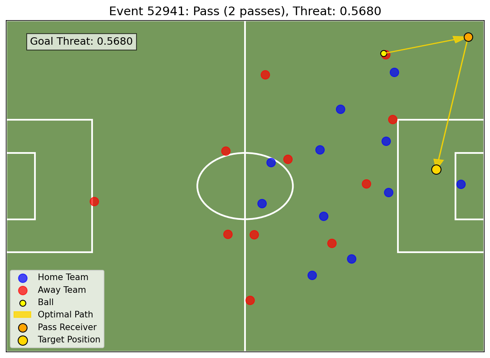
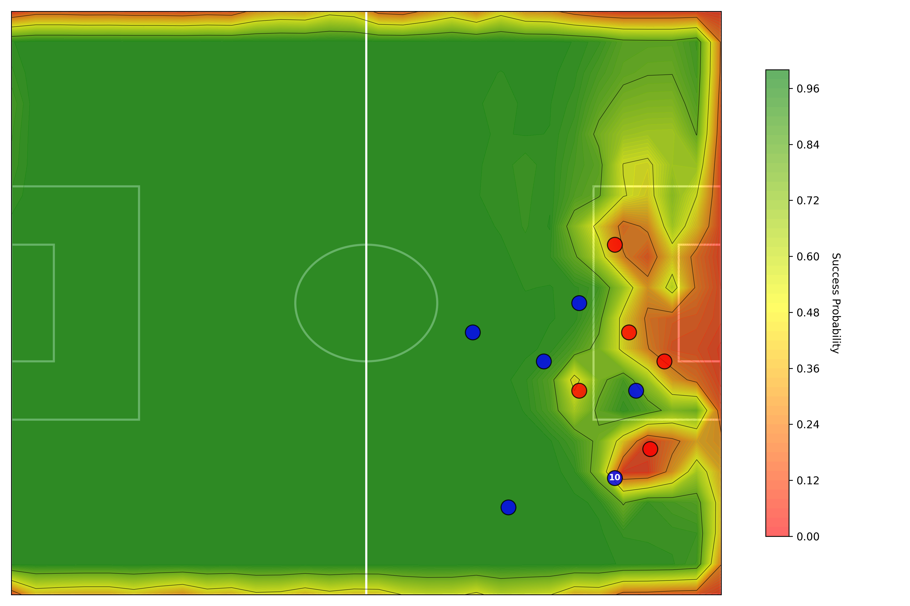
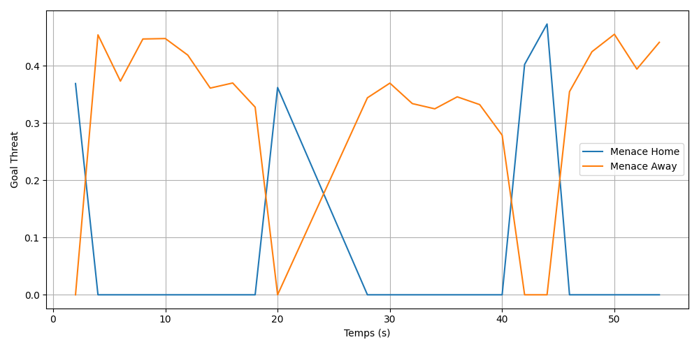

# Goal Threat (GT) — Quantifying the Threat of Conceding a Goal in Football

This repository implements the **Goal Threat (GT) coefficient**, a metric that quantifies the
threat of conceding a goal from *any* position on the pitch, given the positions of all 22 players.
GT combines a supervised **pass-feasibility** model with a **Bellman-inspired recursive formulation**
that captures both the immediate danger of shooting and the future danger created by passes.

It accompanies the paper *"Goal Threat in Football: How to Quantify the Threat of Conceding a Goal
in Football"* (Azéma & Toyoizumi).

<p align="center">
  
</p>
<p align="center">
  <em>GT on a real frame (Metrica tracking data). The model searches every reachable zone and player
  repositioning and returns the optimal action — here a 2-pass sequence (ball → best receiver →
  highest-threat target) with GT = 0.57.</em>
</p>

## What makes GT different

| Model | Key strength | Key weakness |
|-------|--------------|--------------|
| Expected Goals (xG) | Precise shot-quality estimate | Limited to shots, ignores build-up |
| Expected Threat (xT) | Values any pitch position | Ignores player positions (static) |
| Dynamic Expected Threat (DxT) | Adds player positions | Transitions based on xG difference, not pass feasibility |
| **Goal Threat (GT)** | **Based on pass feasibility inside a sequential decision framework** | Simplified player-movement model; capped at 2 passes |

## Method in a nutshell

The pitch is discretized into a **15 × 10 grid** (150 zones). For a ball in zone $n$ with player
configuration $r$, GT is defined recursively:

$$
GT(n, r) =
\begin{cases}
\mathrm{go\_alone}(n, r) & \text{if } n \text{ is a Truth Zone,} \\[6pt]
\max\!\left( \mathrm{go\_alone}(n, r),\ \displaystyle\max_{m,\, r'}\ p(n, m, r')\cdot GT(m, r') \right) & \text{otherwise.}
\end{cases}
$$

Here the inner maximum ranges over all reachable zones $m$ and player repositionings $r'$. Intuitively,
the threat of a position is the best of *shooting/dribbling now* versus *passing to another zone and
recursing on the resulting position*.

- **`p(n, m, r)`** — *pass success probability* from zone `n` to zone `m` given player positions,
  learned from StatsBomb data with engineered defensive-pressure / trajectory-interception features
  (§2.2). Best model: **XGBoost, AUC-ROC ≈ 0.927**.
- **`go_alone(n, r)`** — probability of scoring by going alone (shooting/dribbling) from zone `n`
  (§2.3). Logistic model, **AUC-ROC ≈ 0.72**.
- **Truth Zone** — zones close to goal where shooting is the optimal action (recursion base case).
- **`A(r)`** — a simple model of how players reposition after a pass (defenders drop toward the
  ball–goal line, receiver moves to the ball, the three nearest attackers advance).
- The recursion depth is **capped at 2 passes** for tractability and realism.

Evaluation uses the **Metrica Sports** tracking dataset, which is independent from the StatsBomb
data used to train the pass model.

## Example results

**Pass-success surface `p(n, m, r)`.** For a fixed ball position, the pass model scores the success
probability toward every other zone given the 22 player positions — high near unmarked teammates,
low through defensive pressure. This is the surface the GT recursion maximizes over.

<p align="center">
  
</p>

**Goal Threat over time.** Running GT frame-by-frame turns a match into two threat time-series (one
per team). Peaks mark dangerous build-ups; the metric captures danger *before* a shot is ever taken,
and swings between teams as possession and space change.

<p align="center">
  
</p>

More per-action visualizations (optimal paths, GT maps, heatmaps) are generated under `results/` by
the scripts in [Usage](#usage).

## Repository structure

```
.
├── src/                     # Core pipeline (run scripts as `python src/<script>.py`)
│   ├── config.py            # Central paths (ROOT, DATA_DIR, MODELS_DIR, RESULTS_DIR)
│   ├── Pass_chances_function.py     # Build dataset + train the pass model p(n,m,r)
│   ├── pass_predictor.py            # Load / serve the trained pass model
│   ├── Go_alone_simple.py           # Parametric go_alone predictor
│   ├── Optimisation_parametres_go_alone_simple.py   # Optimize its parameters
│   ├── Logistic_go_alone.py         # Logistic go_alone model (paper §3.2)
│   ├── Expected_Goal_Regressor.py   # XGBoost go_alone/xG predictor used inside GT
│   ├── Goal_threat_classes.py       # Recursive Goal Threat model (core)
│   ├── Graph_evolution_threat.py    # GT evolution over time (paper Fig. 11)
│   ├── Goal_threat_analysis.py      # Extract shots + preceding passes, compute GT
│   ├── Visualize_action_metrica.py  # Visualize actions with the optimal GT path
│   └── Affichage_heatmap_passe.py   # Pass-success heatmaps (paper Fig. 9)
├── examples/                # Standalone demos on synthetic tactical situations
├── notebooks/               # Exploratory notebook
├── models/                  # Trained models (pass, go_alone/shot, xG) + metadata
├── data/
│   ├── metrica/             # Metrica sample matches (tracking CSVs are git-ignored)
│   ├── statsbomb_360/       # StatsBomb 360 JSON (git-ignored — download separately)
│   └── processed/           # Datasets generated by the scripts
├── results/                 # figures/, heatmaps/, goal_threat_maps/, videos/
├── docs/                    # Reference documents
├── requirements.txt
└── README.md
```

## Installation

```bash
python -m venv venv
# Windows:
venv\Scripts\activate
# macOS / Linux:
source venv/bin/activate

pip install -r requirements.txt
```

## Data

The small trained models needed for inference are already in `models/`, so the GT pipeline runs
without retraining. The large datasets are **not** committed (they are public):

- **StatsBomb Open Data** (event + 360 data used to *train* the pass and go_alone models) —
  <https://github.com/statsbomb/open-data>. Place the 360 JSON files in `data/statsbomb_360/`.
- **Metrica Sports Sample Data** (tracking data used to *evaluate* GT) —
  <https://github.com/metrica-sports/sample-data>. Place the game folders under `data/metrica/`
  (e.g. `data/metrica/Game_2_Metrica/Sample_Game_2_RawTrackingData_Home_Team.csv`).

## Usage

All scripts are run from the repository root; paths are resolved relative to the project root by
`src/config.py`, independently of the working directory.

```bash
# Pass-success heatmaps in different tactical situations (Fig. 9)
python src/Affichage_heatmap_passe.py

# Extract shots + preceding passes and compute GT along the way
#   -> writes data/processed/{df_filtered.csv, liste_goal_threat.pkl, liste_optimal_paths.pkl}
python src/Goal_threat_analysis.py

# Visualize each action with the optimal GT path (uses the files above)
python src/Visualize_action_metrica.py

# Goal Threat evolution over the first minutes of a match (Fig. 11)
python src/Graph_evolution_threat.py

# GT on synthetic tactical situations (no external data needed)
python examples/test_threat_situations.py
```

Outputs are written under `results/` (figures, heatmaps, goal-threat maps).

Retraining the pass / go_alone models requires the StatsBomb-derived datasets described above
(`src/Pass_chances_function.py`, `src/Logistic_go_alone.py`,
`src/Optimisation_parametres_go_alone_simple.py`).

## Limitations

- The StatsBomb dataset records the *recovery* location of a failed pass rather than its intended
  destination, which biases the pass model in some situations (e.g. passes toward the corner).
- Player velocities and pass travel time are not modeled (that data is not available here).
- The go_alone model is intentionally simple and only learns from actions that ended in a shot.
- The player-movement model `A(r)` is a coarse approximation; the recursion is therefore capped at
  2 passes.

## Authors

Tanguy Azéma (École Polytechnique) and Hiroshi Toyoizumi (Waseda University).

## Data availability

Event data derive from the StatsBomb Open Data repository; tracking data derive from the Metrica
Sports Sample Data (links above).
